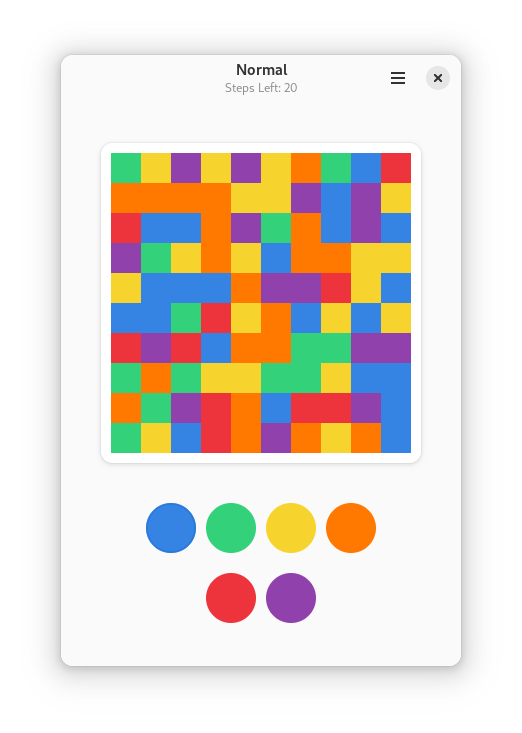

# Flood It

Challenge yourself with this simple, yet addictive strategy game, where you need to flood-it as efficiently as you can!

<br>

<div align="center">



</div>

Flood It is a game with the simple premise of flooding the entire board with one color in the least amount of moves possible. It's based on the original Flood-It! by Lab Pixies [<sub>archived in Wayback Machine<sup>↗</sup></sub>](https://web.archive.org/web/20101226202442/http://www.labpixies.com/gadget_page.php?id=10&platform_id=0)

## How to install:
You can install Flood It in many ways, here are some listed:

**1. Official Flatpak package:**

<a href='https://flathub.org/apps/details/io.github.tfuxu.floodit'>
  
</a><br>

**2. Alternative package distributions:**
> [!WARNING]
> Although some of the methods listed here may be maintained by the Flood It maintainers, these methods **are not** officially supported and issues related to packaging in them should be reported outside this project's bug tracker.

<a href="https://repology.org/project/floodit/versions">
    
</a>

**3. Install from source:**

If you don't find any other options appealing to you, then you can always compile code on your machine from source and install it that way. For more information, check out [How to build](#how-to-build) section.

## How to build:

### GNOME Builder:
This is the easiest way of building Flood It if you want to build it as a Flatpak package. Highly recommended, but probably not for everyone, as GNOME Builder and Flatpak can be quite resource hungry.

1. Download [GNOME Builder](https://flathub.org/apps/details/org.gnome.Builder).
2. In Builder, click the _Clone Repository_ button at the bottom, using `https://github.com/tfuxu/floodit.git` as the URL.
3. Click the _Build_ button at the top once the project is loaded.

### Flatpak Builder:

#### Prerequisites:

- Flatpak Builder `flatpak-builder`
- GNOME SDK runtime `org.gnome.Sdk//47`
- GNOME Platform runtime `org.gnome.Platform//47`

Install required runtimes:
```sh
flatpak install org.gnome.Sdk//47 org.gnome.Platform//47
```

#### Building Instructions:

##### User installation
```sh
git clone https://github.com/tfuxu/floodit.git
cd floodit
flatpak-builder --install --user --force-clean repo/ build-aux/flatpak/io.github.tfuxu.floodit.json
```

##### System installation
```sh
git clone https://github.com/tfuxu/floodit.git
cd floodit
flatpak-builder --install --system --force-clean repo/ build-aux/flatpak/io.github.tfuxu.floodit.json
```

### Meson Build System:

#### Prerequisites:

The following packages are required to build this project:

- Golang >= 1.22 `go`
- Gtk4 >= 4.14 `gtk4`
- Libadwaita >= 1.5 `libadwaita`
- Meson `meson`
- Ninja `ninja-build`

#### Building Instructions:

##### Global installation

```sh
git clone https://github.com/tfuxu/floodit.git
cd floodit
meson setup builddir
meson configure builddir -Dprefix=/usr/local
ninja -C builddir install
```

##### Local build (for testing and development purposes)

```sh
git clone https://github.com/tfuxu/floodit.git
cd floodit
meson setup builddir
meson configure builddir -Dprefix="$(pwd)/builddir" -Dbuildtype=debug
ninja -C builddir install
meson devenv -C builddir ./bin/floodit
```

> [!NOTE] 
> During testing and development, as a convenience, you can use the [`local.sh`](./local.sh) script to quickly rebuild local builds.

## License
<p>

This repository is licensed under the terms of the GNU GPLv3 license. You can find a copy of the license in the COPYING file.
</p>

## Inspirations/Resources:
I've got an idea to create Flood It after playing [Flood](https://man.serenityos.org/man6/Flood.html) on SerenityOS.

Some parts of the backend code used to generate and flood board are based on code from [Open Flood](https://github.com/GunshipPenguin/open_flood) and [The FloodIt! game](https://otfried.org/scala/floodit.html) example made by [Otfried Cheong](https://github.com/otfried/).

I also read explanations of [Flood fill](https://en.wikipedia.org/wiki/Flood_fill) algorithm implementations to better understand the process of board filling in game.

The general structure of this project is based on my [Gotk4 Go + Meson project template](https://github.com/tfuxu/gotk4_meson).
